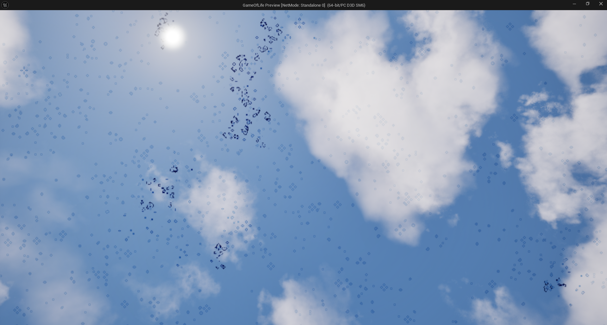
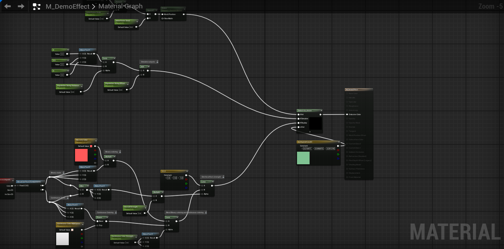

# Game of Life Simulation Plugin

This plugin implements a fully GPU driven **Game of Life simulation** post processing effect integrated into Unreal Engine’s rendering pipeline.  
It combines **SceneViewExtensions**, **Global Shaders**, **Material Shaders**, **RDG passes**, and a **Custom Mesh Pass** to create an interactive screen-space effect that responds to scene geometry.

The sections below describe the main systems used in the final implementation.

## 1. Rendering Pipeline Integration & Screen-Space Output  

The plugin uses Unreal's SceneViewExtension to inject custom rendering logic into Unreal Engine's pipeline. 

A set of shaders defines the compute and pixel shaders used for:

- Initializing simulation textures  
- Stepping the automata each frame  
- Displaying the simulation on screen  

## 2. Material Shader Integration & Artist Control  

Material Shaders allow artists to influence the simulation directly via the Material editor.  

## 3. Custom Mesh Pass & GPU Simulation  

The core of the plugin is a **Custom Mesh Pass**, registered alongside Unreal’s built-in passes.  
This pass collects primitives marked through the Material system and renders them into a mask texture, which acts as the input for the simulation.

A complete RDG pipeline manages the simulation:

### Simulation Pass (Compute Shader)
- Applies Game of Life rules  
- Performs double-buffering  
- Reads from previous state, writes to next state  

### Resample Pass
- Maintains simulation continuity when viewport resolution changes  

### Display Pass (Pixel Shader)
- Blits the simulation result into the final render using a fullscreen pass  

